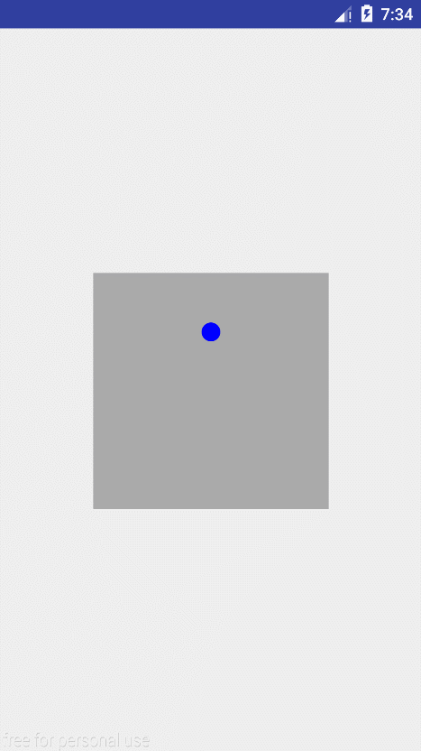
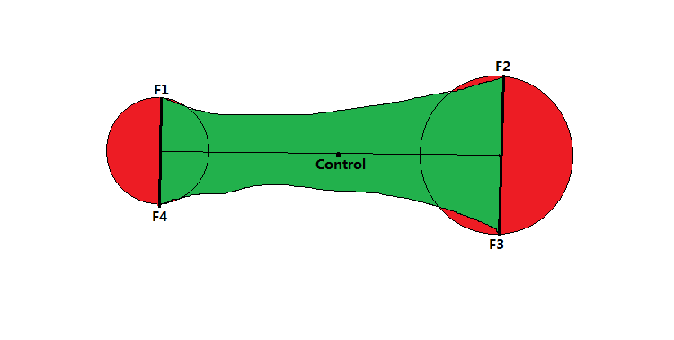
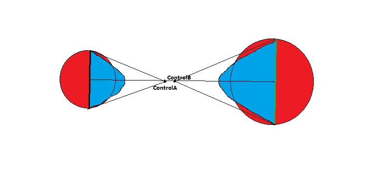
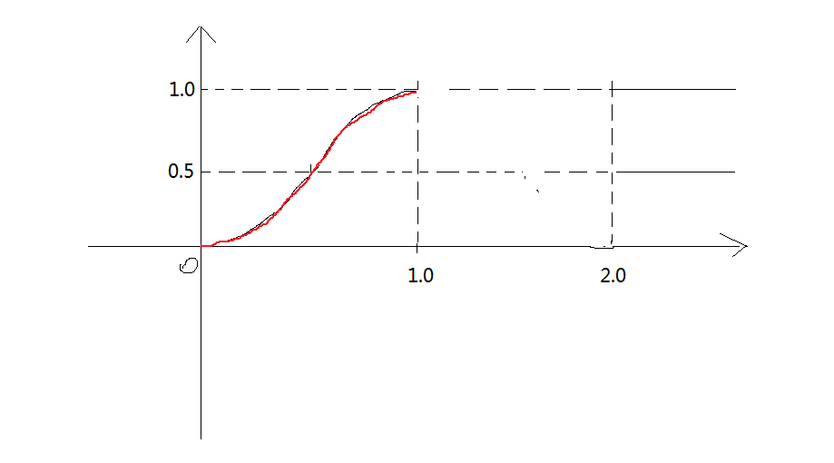

## WaveView

## BezierView

## BallView

## LoadingView
正常速度效果：

慢速度效果：

#####  两个圆球的融合、分离过程解析

**有三个基本部分** 
* 圆球部分

* 圆球与圆球连接（融合）时，绘制的区域为下图绿色区域。

* 圆球与圆球不连接（分离）时的贝塞尔曲线，绘制的区域为下图蓝色区域。

##### 坐标的计算

这里所有圆球得路径都是圆形路径。只需要两个角度值：

* 主圆球（最大的那个圆球）扫过的角度a；
* 其他圆球与主圆球的夹角delta。

**注：**我们这里的起始角度为Math.PI/2，即顶部。

这里我们只记录主圆球相对于路径的角度a，以及其他小圆球相对于大圆球的角度delta，如下图：

##### 主球的运动角度a

* 在顶部时，速度为0，在底部时，速度最大

根据上面要求决定使用正弦函数（只使用半个整周期），该正弦函数需满足如下条件：

* 因动画进度为0~1，使用半个周期，所以波长为2；
* 这里我只需要将进度变换，不做其他操作，所以变换后的取值范围也为0~1，那么均值为0.5，幅度为0.5;
* 因其实位置在圆轨迹顶部，所以起始角度为Math.PI/2.

综上要求，正弦函数公式如下:

###### 0.5*Math.sin(Math.PI*(mFraction-0.5))+0.5

其波形如下：

##### 各圆球与主圆球的夹角

* 在顶部时，夹角为0，在底部时，夹角最大
* 且越靠近底部，夹角越大

根据以上要求，同样适用正弦函数（使用一个整周期），该正弦函数需满足如下条件：

* 因动画进度为0~1，使用一个周期，所以波长为1；
* 这里我只需要将进度变换，不做其他操作，所以变换后的取值范围也为0~1，那么均值为0.5，幅度为0.5;
* 起始角度为0.

综上要求，正弦函数公式如下:

###### 0.5*Math.sin(Math.PI*2*(mFraction-0.25))+0.5;

其波形如下：

