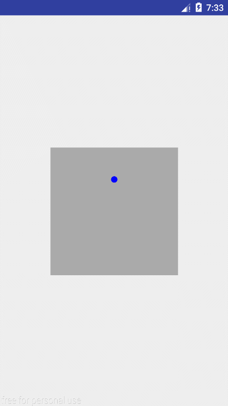
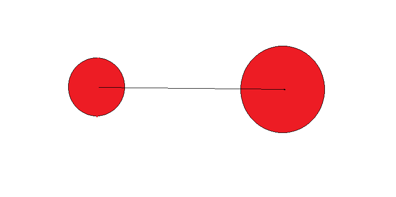

### LoadingView
正常速度效果：

慢速度效果：

#####  绘制三个部分： 
* 圆球部分，即绘制圆，这里为6个

* 圆球与圆球连接时的贝塞尔曲线

* 圆球与圆球不连接时的贝塞尔曲线

##### 坐标的计算
这里我们只记录主圆球相对于路径的角度a，以及其他小圆球相对于大圆球的角度delta，如下图：

我们要实现主圆球的运动一圈的效果为：
* 从顶端速度为零、运动到底端速度最快
* 从底端速度最快，运动到顶端速度为0

###### 主球的运动角度
这里我使用了正弦函数的前半个周期来实现：
第一个周期为Math.PI*2的三角函数：
    	
-Math.sin(fraction)-

但是我们的动画执行进度为0-1，所以需要将周期缩短为2，此时的三角函数：

-Math.sin(Math.PI*fraction)-
如图第二个三角函数

同时我们的起始角度为Math.PI/2,所以此时的三角函数为
-Math.sin(Math.PI*(fraction-0.25f))-
如图第三个三角函数

###### 非主球与主球之间的运动角度
使用上图中的第二个三角函数，在顶端附近时，非主球与主球之间夹角较小；
在底端附近时，非主球与主球之间的夹角较大